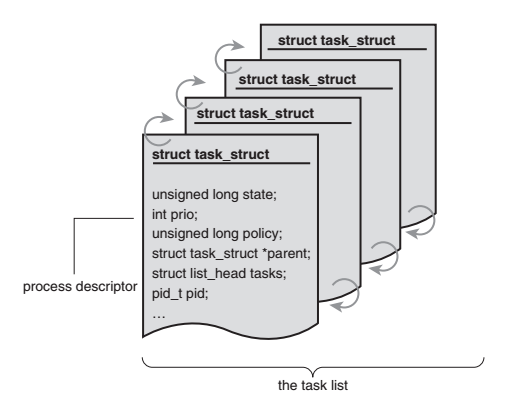
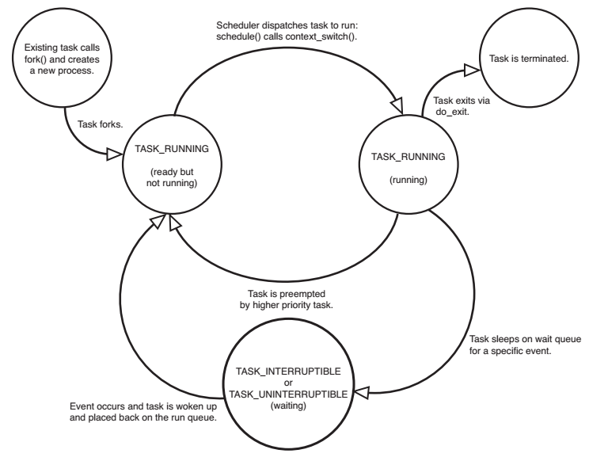
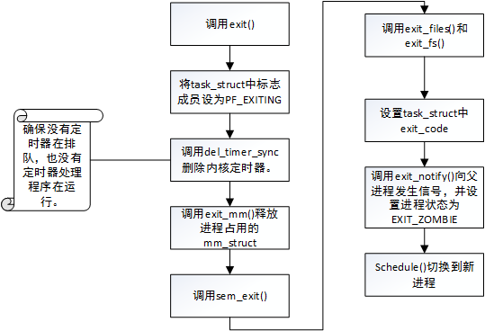

## 进程管理

### 进程

进程是处于执行期的程序，但并不仅仅局限于一段可执行程序代码，通常还要包括其他资源，比如打开的文件、挂起的信号、内核数据、处理器状态、一个或多个具有内存映射的内存地址空间及一个或多个执行线程，当然还包括用来存放局部变量的数据段等。**实际上，进程就是正在执行的程序代码的实时结果。程序本身不是进程，进程是处于执行期的程序及其相关资源的总称。**

线程，是在进程中活动的对象。每个线程都拥有一个独立的程序计数器、进程栈和一组进程寄存器。**内核调度的对象时线程，而不是进程。linux不区分进程和线程，对linux而言，线程不过是一种特殊的进程。**

进程提供两种虚拟机制：**虚拟处理器和虚拟内存。**

fork():该系统调用通过复制一个现有的进程来创建一个全新的进程。该调用从内核返回两次，一次回到父进程，另一次回到新产生的子进程。
通常，创建新的进程都是为了立即执行新的、不同的程序，而接着调用exec()这组函数，就可以创建新的地址空间，并把新的程序载入其中。

最终程序通过exit()调用退出执行。这个函数会终结进程并将其占用的资源释放。父进程可以通过wait4()系统调用查询进程是否终结，进程退出执行后被设置为僵死状态，直到它的父进程调用wait()或waitpid()为止。

### 进程描述符及任务结构

内核把进程的列表放在叫做 **任务队列** 的双向链表，链表中每一项都是类型为 **task_struct** 称为**进程描述符**的结构。**进程描述符包含了一个具体进程的所有信息。**




#### 分配进程描述符

linux通过slab分配器分配 task_struct 结构，在栈底（对向下增长的栈来说）或栈顶（对向上增长的栈来说）创建一个新的结构struct  thread_info。每个任务的thread_info结构在它的内核栈尾端分配，结构中task指针存放的是任务实际的task_struct 的结构体。

#### 进程描述符的存放

内核通过一个唯一的进程标识值（PID）来标识每个进程。

在内核中，访问任务通常需要获得指向其task_struct 的指针，可以通过current 宏来查找当前正在运行进程的进程描述符。

[Linux 内核的 thread_info 结构 ](http://blog.jobbole.com/107656/)

#### 进程状态




#### 进程家族树

linux内核中，所有**进程**都是PID为1的init进程的后代。内核在启动的最后阶段启动init进程。该进程读取系统初始化脚本并执行其他相关的程序，并最终完成系统启动的过程。

### 进程创建

- fork()通过拷贝当前进程创建一个子进程，与父进程区别仅在于PID,PPID 和某些资源和统计量。
- exec()负责读取可执行文件，并载入地址空间开始运行。

#### 写时拷贝

写时拷贝是一种可以推迟甚至免除拷贝数据的技术。内核此时并不复制整个进程地址空间，而是让父子进程共享同一个拷贝，只有在需要写入的时候，数据才会被复制.，从而使各个进程拥有各自的拷贝。也就是说，**资源的复制只有在需要写入的时候进行。** 在页根本不会被写入的情况下（fork()之后立即调用exec()），他们就无须复制，fork()的实际开销就是复制父进程的页表以及给子进程创建唯一的进程描述符。

#### fork()

fork()、vfork()、_clone()库函数都根据各自需要的参数标志去调用clone()，然后由clone()去调用do_fork()。do_fork()完成了创建中的大部分工作，该函数调用copy_process()函数，, 并根据指定的标志复制父进程的数据 然后让进程开始工作。

1. 调用 copy_process 为子进程复制出一份进程信息
2. 如果是 vfork（设置了CLONE_VFORK和ptrace标志）初始化完成处理信息
3. 调用 wake_up_new_task 将子进程加入调度器，为之分配 CPU
4. 如果是 vfork，父进程等待子进程完成 exec 替换自己的地址空间

copy_process工作流

1. 调用 dup_task_struct 复制当前的 task_struct
2. 检查进程数是否超过限制
3. 初始化自旋锁、挂起信号、CPU 定时器等
4. 调用 sched_fork 初始化进程数据结构，并把进程状态设置为 TASK_RUNNING
5. 复制所有进程信息，包括文件系统、信号处理函数、信号、内存管理等
6. 调用 copy_thread_tls 初始化子进程内核栈
7. 为新进程分配并设置新的 pid

[Linux下进程的创建过程分析 ](https://blog.csdn.net/gatieme/article/details/51569932)

### 线程在linux中的实现

Linux中，线程仅仅被视为一个与其他进程共享某些资源的进程 。每个线程都拥有唯一隶属于自己的task_struct，所以在内核中，它看起来就像是一个普通的进程。

线程的创建和普通进程的创建类似，不过在调用clone()时需要传递一些参数标志来指明需要共享的资源：

```C
clone(CLONE_VM | CLONE_FS | CLONE_FILES | CLONE_SIGHAND, 0);
```

调用的结果和fork()差不多，不过父子俩共享地址空间，文件系统资源，文件描述符和信号处理程序。

内核经常需要在后台执行一些操作，这种任务可以通过内核线程完成——独立运行在内核空间的标准进程。内核线程和普通进程的区别在于内核线程没有独立的地址空间，它们只在内核空间运行，从来不切换到用户空间，可以被调度，也可以被抢占。

### 进程终结

do_exit工作流程：




do_exit()后尽管线程已经僵死不再运行了，但还是保留了它的进程描述符，这样做的目的是为了让系统在子进程终结后仍能获得它的信息。当父进程调用wait()系统调用后才会删除进程描述符，会调用release_process()。至此进程描述符和所有进程独享的资源就全部释放掉了。

### 参考

[Linux进程管理与调度](https://blog.csdn.net/gatieme/article/details/51456569)

[用户空间和内核空间](https://www.cnblogs.com/Anker/p/3269106.html)

[Linux下0号进程的前世(init_task进程)今生(idle进程) ](https://blog.csdn.net/gatieme/article/details/51484562)